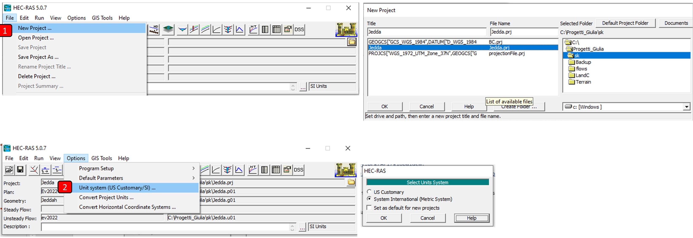
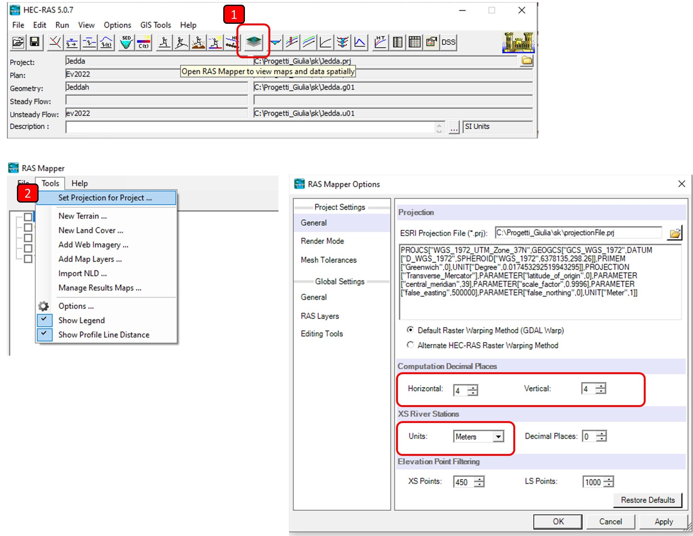
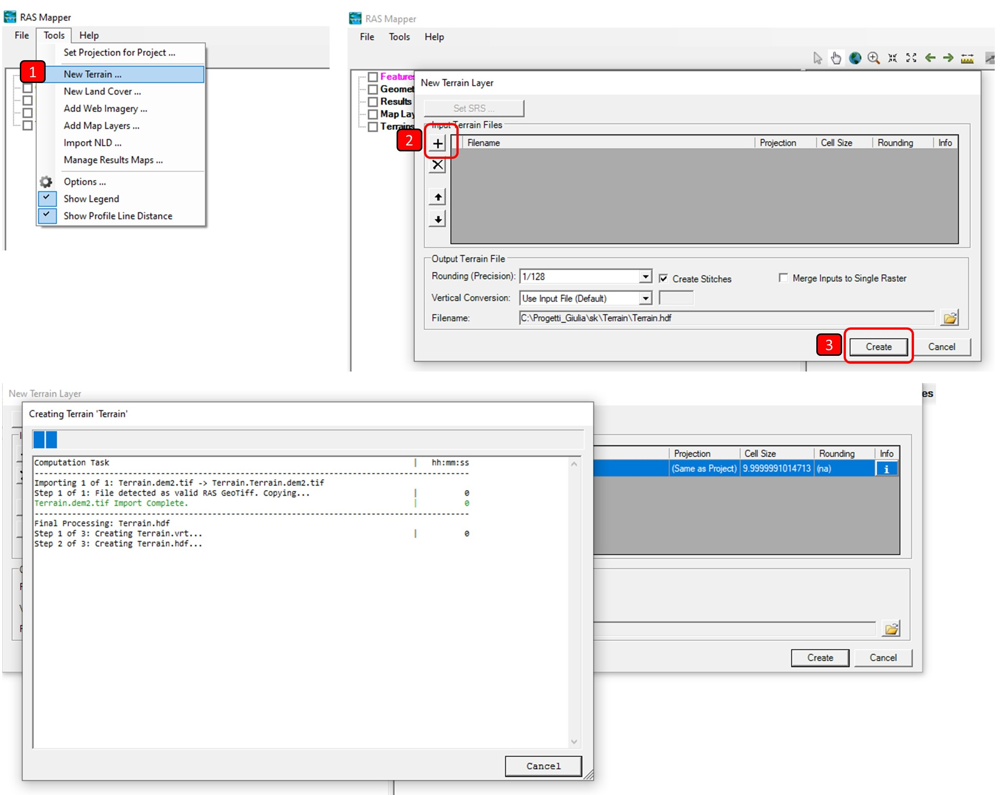
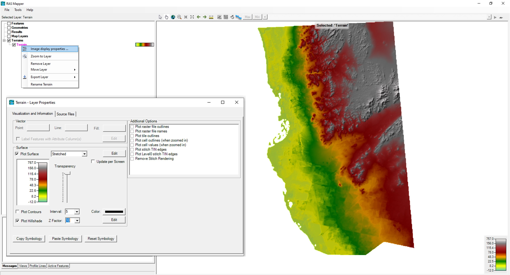
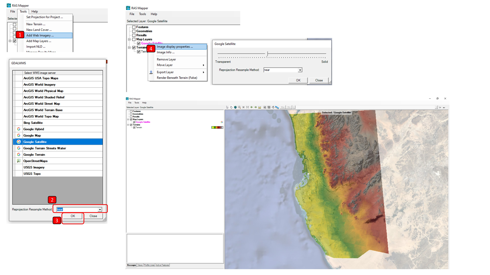

## HECRAS Terrain model creation and processing
Keywords: `Hydraulics` `HEC-RAS` `2D` `Modeling` `Terrain`

 giulia.sofia@uconn.edu 

### Scope
This section presents the recommended steps to create a project, provide the correct configuration for RAS Mapper, and create the main terrain model.

### Goals
* Create the HEC-RAS project and set the general configuration of RAS Mapper.
* Create the RAS Mapper terrain (.hdf) from the raster layer.
* Visualize and represent the terrain model in RAS Mapper.
* Associate maps and public domain images as background.

### Project creation and RAS-Mapper configuration

The following is the recommended process for creating the RAS Mapper project and configuring it.

1. Once the program starts, go to the menu **File → New Project** (File →New Project). In the pop-up window you can indicate the name of the project to be created and click <kbd>OK</kbd>. Review and/or adjust the unit system to be used in the **Options → Unit system** menu.

2. Access the RAS Mapper tool by clicking on the **Mapper** button. Then select **Tools → Set Projection System** (Tools → Set Projection for Project). In the popup window, select the projection file to use.

*note that it is important to increase the number of decimal places in the elevation and accuracy, to avoid issues*

3. In this same window or through **Tools → Options** (Tools → Options), it is possible to configure various RAS Mapper options, as described below.

   - Rendering mode (Render mode): You can select the rendering mode between inclined (Sloping), horizontal (Horizontal) or hybrid (Hybrid). The first is made from the interpolation of the elevations of the water sheet on each side of the cell and allows the surface to appear inclined and continuous. The second is presented from the water depth elevations obtained in each cell.
   - General configuration (Global Settings- General): Contains symbols of the map visualization tools and decimal digits for visualizing results on the fly on the screen.
   - Layer settings (Global Settings- RAS Layers): Contains the visualization symbology of different layers that make up the model.
   - Editing Tools (Global Settings- Editing Tools): Contains the symbology of the editing tools and the approximation tolerances for nearby points and lines.

### Terrain model creation and processing

The following is the recommended process for creating and processing the terrain model.

1. In the RAS Mapper go to **Tools → new terrain**
2. In the displayed window **New Terrain Layer** (New Terrain Layer), you can load the information in Raster format (GDAL library, Raster Floating Point Format type, and GRID). There you can upload one or several files and even merge (merge) several raster files into the new RAS terrain model. In the window you can select the rounding or precision of the new file, the creation of stitches (stitches) if a union (merge) is made, the conversion or not of units and the name of the file to be created. The new file will be saved by default in the **Terrain** folder in *.hdf* format.
3. Click **Create** and a window will open with the creation process.

4. Next, you will be able to view the terrain created in the RAS Mapper. You can also modify the display options.

### Public domain maps and images

An additional feature of RAS Mapper is the inclusion of background maps and satellite images. This feature can only be used if the project has been assigned a coordinate projection system. To add, right click on **Map Layers → AddWebImageryLayer** and choose, for example, Google's satellite image and Nearest Neighbor as sampling method. From the image properties, set transparency to about 25%.

### References
- [HEC-RAS 2D User's Manual. US Army Corps of Engineers.](https://www.hec.usace.army.mil/confluence/rasdocs/r2dum/latest)
- [HEC-RAS Mapper User's Manual](https://www.hec.usace.army.mil/confluence/rasdocs/rmum/latest)

