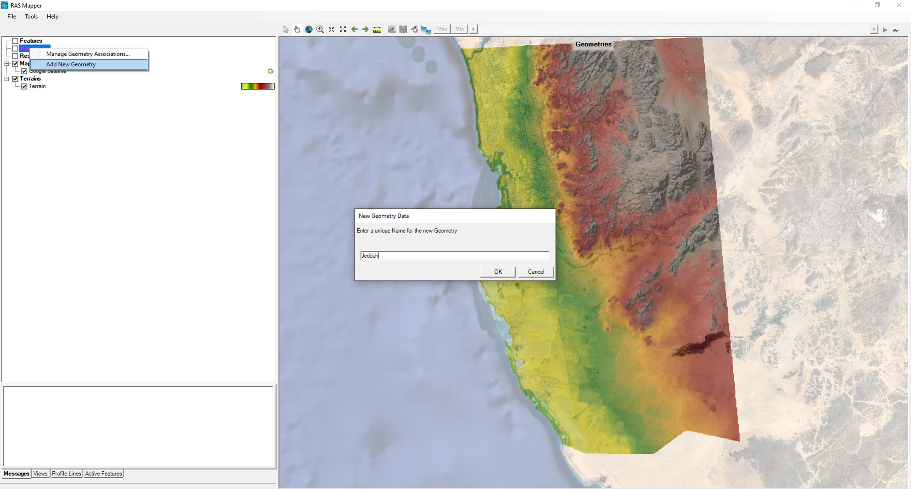
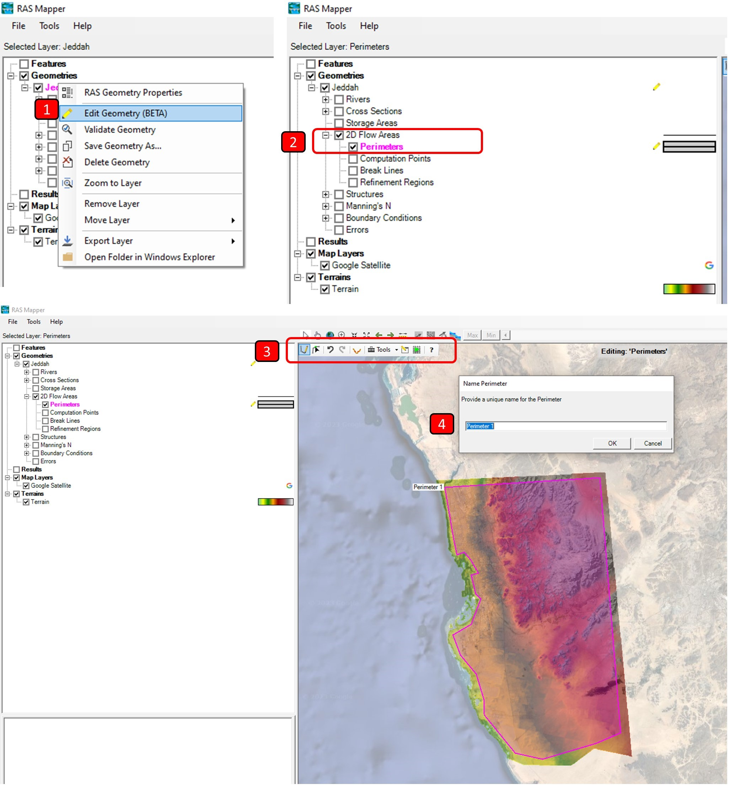
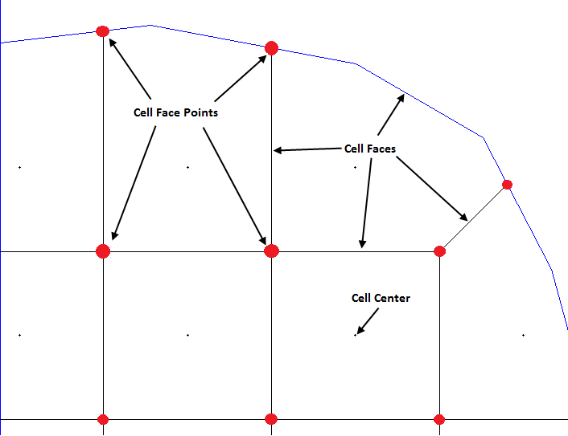
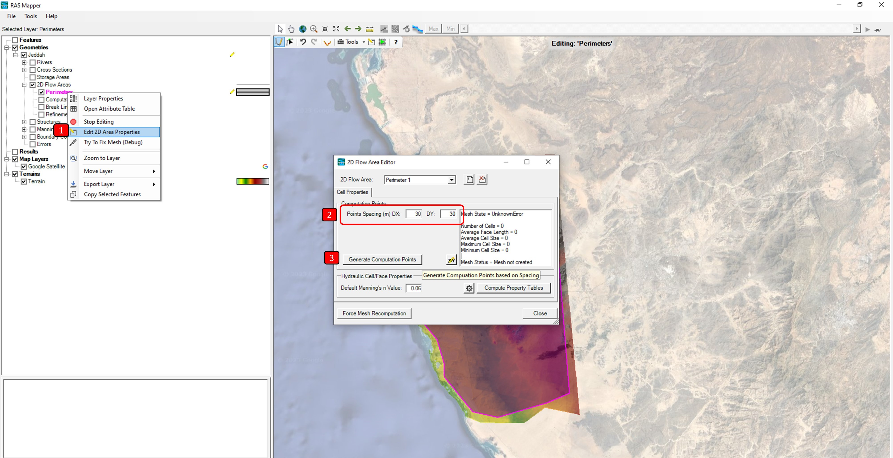
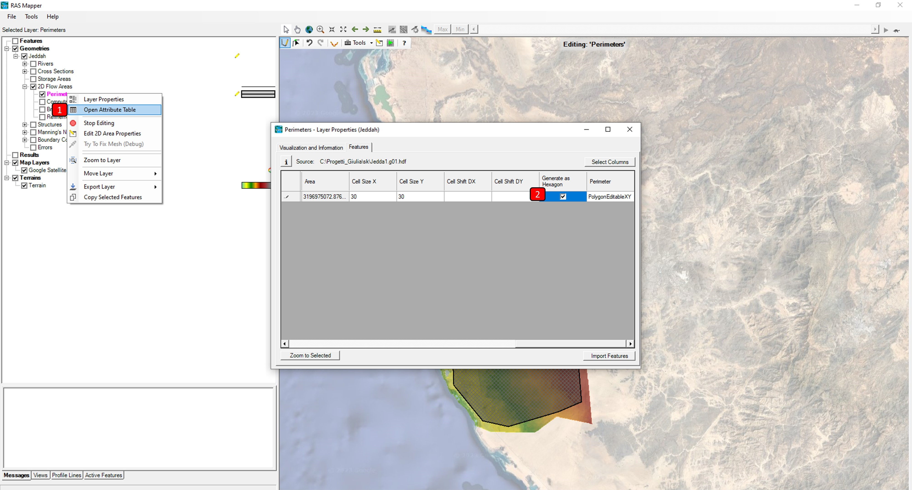
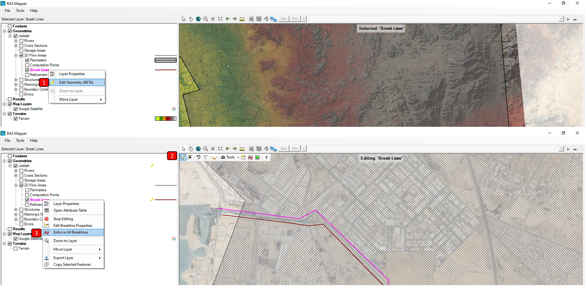

## Mesh creation and processing
Keywords: `Hydraulics` `HEC-RAS` `2D` `Modeling` `Mesh`

 giulia.sofia@uconn.edu 

### Scope
This class presents the recommended process for the delimitation of the domain area and the creation of the mesh of the two-dimensional (2D) model.

### Goals

* Create the geographical limit of the study or modeling area.
* Define the spacing of the grid between cells.
* Generate computational points.
* Create lines or regions for mesh refinement.
* Refine the mesh in RAS Mapper and correct the wrong cells.

### Definition and delimitation of the domain area

The 2D modeling requires, in addition to a digital terrain model (DTM), the geographical limit of the study area within which the two-dimensional mesh will be defined. It is HEC-RAS, these areas are known as **2D Flow Areas** and can be drawn manually from this tool or from a vector file previously defined with another tool.

The recommended process for the geographical delimitation of the study area, drainage or modeling is presented below.

1. In the RAS Mapper right click on **Geometries** and select **Add New Geometry. In the popup window, add a clear name.

2. Launch the editing option by clicking the *pencil* button. Expand the **2D Flow Areas** tree and select **Perimeters**. Using the drawing bar you can manually trace the 2D perimeter of the study area.

> The 2D flow area can also be imported from a vector geographic file. To do this, in edit mode, right-click on **Perimeters** and select **Import Features From Shapefile**. Select the file, and then review all the parameterizable properties for the imported perimeter.
At the end you will be able to view the perimeter drawn on the map.

> Note: the 2D flow area can not be outside the extent of the terrain. if there are 'holes' in the terrain, included in the 2d domain, HEC will give error.

### Creation and definition of the 2D mesh

A computational mesh or grid is created from the definition of a 2D drainage area. Each cell of the mesh is composed of the following 3 properties.

<i>HEC-RAS 2D modeling computational mesh terminology. From HEC-RAS 2D Modeling User Manual. Page 3-5.</i> 

**Cell Center**:The computational center of the cell. This is where the water surface elevation is computed for the cell. The cell center does not necessarily correspond to the exact cell centroid.
**Cell Faces**:These are the cell boundary faces. Faces are generally straight lines, but they can also be multi-point lines, such as the outer boundary of the 2D flow area.
**Cell Face Points**:The cell Face Points (FP) are the ends of the cell faces. The Face Point (FP) numbers for the outer boundary of the 2D flow area are used to hook the 2D flow area to a 1D elements and boundary conditions.

The recommended process for the creation and definition of the two-dimensional mesh of the modeling is presented below.

1. While in edit mode, right-click **Perimeters** and then click **Edit 2D Area Properties**. For the perimeter created, define the cell spacing and click <kbd>Generate Computation Points</kbd>. You can also assign a default value for the Manning roughness coefficient for cells that are not associated with a cap layer, and review the default values ​​for the tolerances. To avoid memory issues, for this tutorial we can set the mesh size to 100m.

> Note: The point spacing controls the overall number of cells and consequently the computational cost and the processing time to solve the 2D model. The cell spacing should not be smaller than the terrain data resolution.

> **Shape of the cells**: Generally, for irregular 2D Flow Areas, the internal mesh is made of regular structured shape and the border cells of irregular shape, thus creating a composite unstructured mesh. RAS Mapper has been designed to use Unstructured composite meshes, however, depending on the geometry of the 2D Flow Area, it can also work with fully structured meshes. By right-clicking on Perimeters and then clicking on Layer Properties, you can activate the box for generating hexagonal compound cells in Features. You will need to click <kbd>Generate Computation Points</kbd> in the editing window to generate the mesh again.

2. Don't forget to save the geometry changes.

### 2D mesh refinement

After creating the computational mesh, you can add lines or regions for refinement. Cutline refinement is typically used at the crest zones of levees or banks and along roads to define flow limits, or to control its direction.

Refinement regions work similar to breaklines and are mostly used when refinement lines are close together or when you want to change the internal size of cells and their outline in a given region, for example, in buffer zones, reservoirs, hydraulic structures, along the entire valley or in areas with closed curved contours.

The following is the recommended process for mesh refinement:

1. In edit mode, select **Breaklines** or **Refinement Regions**, depending on whether you will be using lines or regions. Then with the edit bar draw the refinement lines or regions.

2. Now right click on the **Breaklines** or **Refinement Regions** and select **Enforce All Breaklines** or **Enforce All Regions**, depending on the case. On the map you will see the adjustment made to the mesh with the lines or regions. Save the geometry changes.

> Note: During refinement, some cells might be geometrically resolved with a greater number of faces than the 8 allowed. For the correction, these cells must be separated into 2 or more, adding additional computation points in edit mode. You can follow this process:
   * Navigate the mesh near the refinement area and identify the erroneous cells (red circles).
   * Zoom in on the wrong cell and check the number of heads.
   * In edit mode (selecting the **Computation points**), add a new point inside the cell close to the area with the largest number of faces.
   * Save the changes made.

> Lines or regions for refinement can also be imported into RAS Mapper from vector geographic files. In edit mode (<kbd>:pencil2:</kbd>), right click on the **Breaklines** and select **Import Features From Shapefile**.
> In the popup window, define the spacing and review the properties of the file to import and click <kbd>Import Features</kbd>. You will see the first adjustment made to the mesh and the breaklines. For regions, repeat the same process, but selecting **Refinement Regions**

### References
- [HEC-RAS 2D User's Manual. US Army Corps of Engineers.](https://www.hec.usace.army.mil/confluence/rasdocs/r2dum/latest)
- [HEC-RAS Mapper User's Manual](https://www.hec.usace.army.mil/confluence/rasdocs/rmum/latest)
