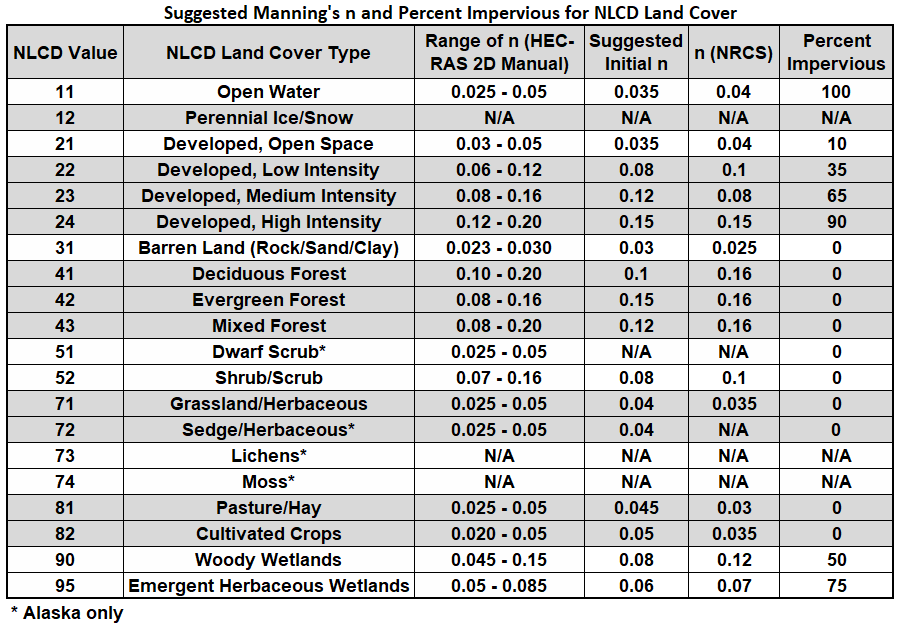

## Manning Coefficients from Land Cover and boundary conditions
Keywords: `Hydraulics` `HEC-RAS` `2D` `Modeling` `Unsteady` `Hydraulic` `Manning` 

 <b>Giulia Sofia, PhD</b> 
 giulia.sofia@uconn.edu 
 

### Scope
This class presents the recommended process for the definition of the Manning coefficient in the hydraulic model from a land cover file using RAS Mapper.

### Goals

* Know the procedure for loading land cover maps.
* Know the procedure for the adjustment and edition of the geometry from the information of Manning coefficients.
* Set the upstream and downstream boundary conditions.
#### Land cover maps

From an analytical point of view, it is possible to associate landcover data with **n** values ​​of the Manning coefficient, taking into account the recommendations mentioned in literature, attributing standard coefficients to standard landcovers. The following image shows for example, the suggested association, where a value **n** is assigned to different land cover characteristics.

<i>Example Manning's n values for various NLCD Land Cover Types. From HEC-RAS manual</i> 

#### Manning coefficient map creation

1. Free high resolution landcover data can be obtained from

  https://zenodo.org/record/7254221
  at 10m, or
  https://zenodo.org/record/3939050
  at 100m

  you can optionally download the data using the dedicated web-browser
  https://viewer.esa-worldcover.org/worldcover/
  if you create a registered user

The ESA landcover classes are as follows

</table>
<table class="eecat">
<tr>
<th scope="col">Value</th>
<th scope="col">Color</th>
<th scope="col">Description</th>
</tr>
<tr>
<td>10</td>
<td>#006400</td>
<td>Tree cover</td>
</tr>
<tr>
<td>20</td>
<td>#ffbb22</td>
<td>Shrubland</td>
</tr>
<tr>
<td>30</td>
<td>#ffff4c</td>
<td>Grassland</td>
</tr>
<tr>
<td>40</td>
<td>#f096ff</td>
<td>Cropland</td>
</tr>
<tr>
<td>50</td>
<td>#fa0000</td>
<td>Built-up</td>
</tr>
<tr>
<td>60</td>
<td>#b4b4b4</td>
<td>Bare / sparse vegetation</td>
</tr>
<tr>
<td>70</td>
<td>#f0f0f0</td>
<td>Snow and ice</td>
</tr>
<tr>
<td>80</td>
<td>#0064c8</td>
<td>Permanent water bodies</td>
</tr>
<tr>
<td>90</td>
<td>#0096a0</td>
<td>Herbaceous wetland</td>
</tr>
<tr>
<td>95</td>
<td>#00cf75</td>
<td>Mangroves</td>
</tr>
<tr>
<td>100</td>
<td>#fae6a0</td>
<td>Moss and lichen</td>
</tr>
</table>
<i>Landcover class [Source: https://developers.google.com/earth-engine/datasets/catalog/ESA_WorldCover_v100]</i> 

> Note: the files downloaded from the above repositories are in geographic coordinates. You will need to reproject them to be consistent with the project coordinate system.
  
2. From the HEC GUI go to RAS Mapper. We can import the file in raster format by clicking on **Project → Tools → New Land Cover**
   In the displayed window select the <kbd>+</kbd> icon to add the file. Then add the Manning coefficients. We will start with the recommended value, and then do a further run using the higher end of the table above.
Review the classification names and information in the output file. Finally, click on <kbd>Crate</kbd> and the process will start.

 
4. Once the layer is created, you can view and review the information generated in RAS Mapper.

5. It is important to associate this layer with the geometry data. This is a commonly overlooked step for new users.

### Boundary conditions

> Note: The spatial location of two different boundary conditions (BC – Boundary Condition Line) can not be defined on the same grid cell.

Multiple boundary conditions can be added to the composite mesh, and each can be associated to a hydrograph.
For modeling, at least one boundary condition line upstream and one downstream must be entered. Boundary condition lines can be drawn internally or externally, and they can be drawn or imported using a shapefile.

The following is the recommended process for importing the lines

1. In RAS Mapper edit mode, display the **Geometries** and **2D Flow Areas** tree. Then select the boundary condition lines and click layer properties. From there, select 'features' and select 'import features'

Once you imported the features, you have to make sure that the lines are all covered by the extent of the domain, and by the computational area. The only exception is the downstream condition, which can be 'External'. In RAS Mapper edit mode, you can manually adjust the features and eventually delete those that you do not need, or add more where needed.

The following is the recommended process for drawing the lines

1. In RAS Mapper edit mode, display the **Geometries** and **2D Flow Areas** tree. Then select the boundary condition lines and with the edit bar draw in plan the upstream and downstream BC lines. Take into account that the traced line must be located in front of the cells of the channel zone. It is recommended to draw lines BC from left to right taking the flow direction as a reference. When finished, save the editing changes.

### References
- [HEC-RAS 2D User's Manual. US Army Corps of Engineers.](https://www.hec.usace.army.mil/confluence/rasdocs/r2dum/latest)
- [HEC-RAS Mapper User's Manual](https://www.hec.usace.army.mil/confluence/rasdocs/rmum/latest)
