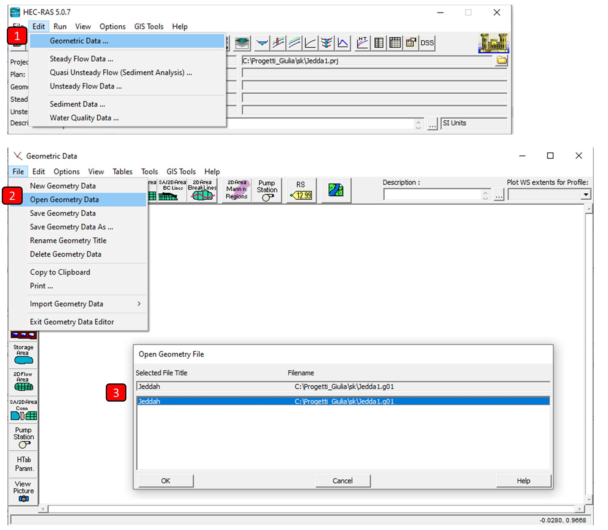
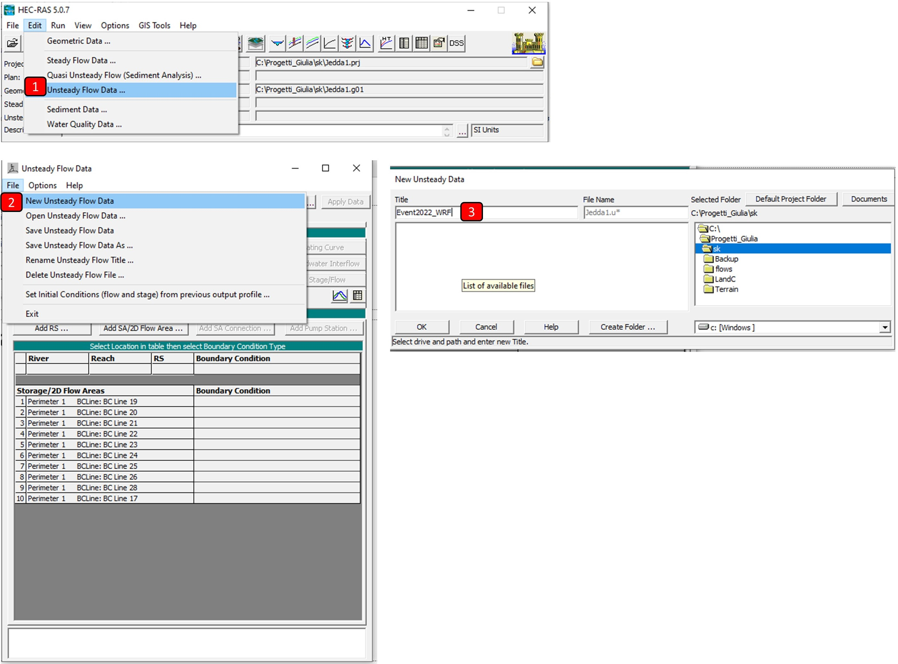
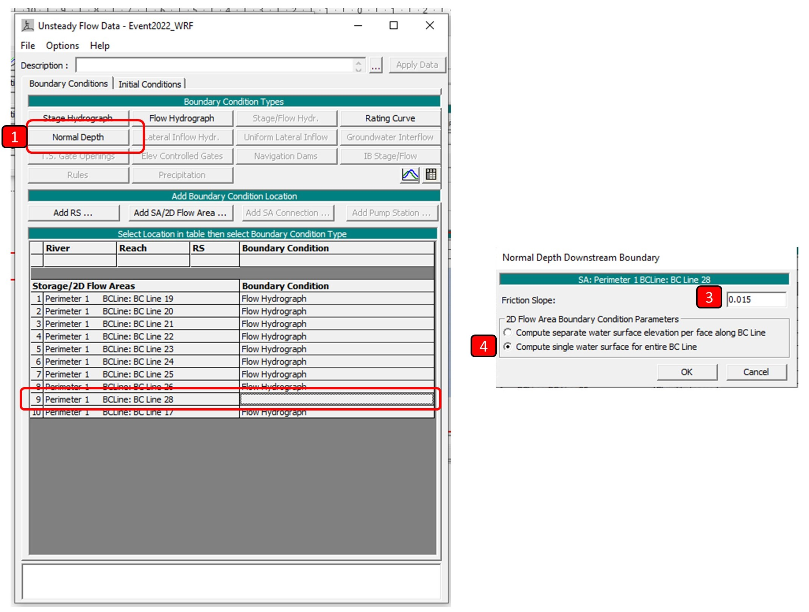
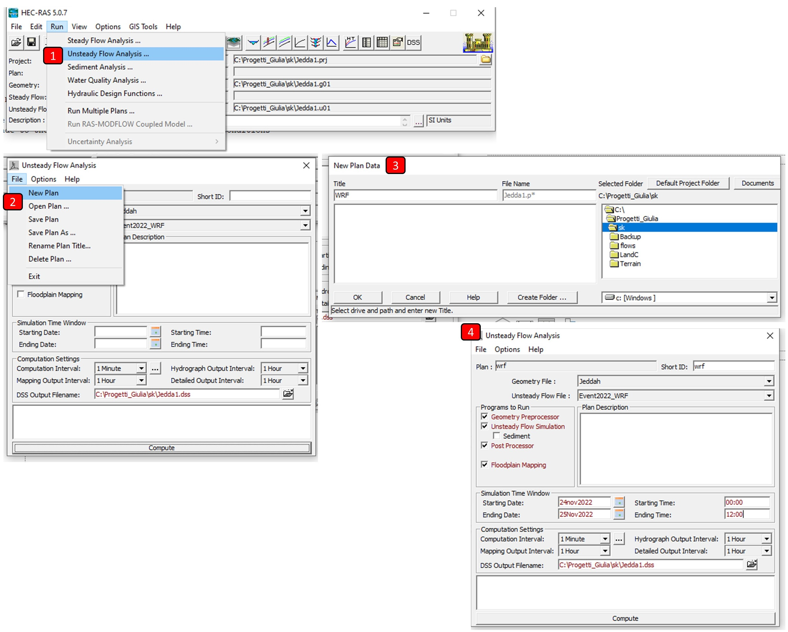

## 2D two-dimensional hydraulic modeling
Keywords: `Hydraulics` `HEC-RAS` `2D` `Modeling` `Unsteady` `Hydraulic`  

 <b>Giulia Sofia, PhD</b> 
 giulia.sofia@uconn.edu 
 

### Reach
This section highlights the procedures to set the input flows, and do a (2D) simulation in unsteady flow conditions.

### Goals

* Define flow information and boundary conditions.
* Carry out the configuration of the simulation plan.
* Configure variable time intervals.
* Define the system of equations to solve the hydraulic model.
* Run the two-dimensional hydraulic simulation.

### Make sure geometry is correctly loaded

It can happen that HEC-RAS does not automatically load the geometry created in the previous steps. If the line for geometry remains blank in the main GUI, go to **Edit → Geometric data** and in the new popup window, select **Open geometry data**
In the window, point to the geometry file created in the previous section. Click the <kbd button >**OK**</kbd> and exit this window.

### Flow information and boundary conditions

1. To start, we are going to enter the **Unsteady flow data** window, from the menu **Edit → Unsteady flow data**. In the popup window select **File → New/Save unsteady flow data** and enter the name you want to give the flow data and click the <kbd button >**OK**</kbd>.

In the **Unsteady flow data** window, you can enter a description of the flow information, as well as define the boundary conditions, initial conditions and add meteorological or observed information in the system to model. For this exercise, we will add a flow hydrograph upstream of the channel for each upstream, and define smooth flow in the downstream section (BC Line 28). 

2. Hydrographs as upstream conditions: from the resource folder, you can find the flows simulated for the 2022 event, at each outlet [resources/inputFlows_WRF.zip]. 
The BC numbers corresponds to the folling outlets

</table>
<table class="eecat">
<tr>
<th scope="col">BC name HEC_RAS</th>
<th scope="col">Outlet name CREST</th>
</tr>
<tr>
<td>BC Line 17</td>
<td>372780_5.csv</td>
</tr>
<tr>
<td>BC Line 18</td>
<td>372780_8.csv</td>
</tr>
<tr>
<td>BC Line 19</td>
<td>372766_1.csv</td>
</tr>
<td>BC Line 20</td>
<td>372766_2.csv</td>
</tr>
<td>BC Line 21</td>
<td>372613_3.csv</td>
</tr>
<td>BC Line 22</td>
<td>372613_2.csv</td>
</tr>
<td>BC Line 23</td>
<td>372613_1.csv</td>
</tr>
<td>BC Line 24</td>
<td>372522.csv</td>
</tr>
<td>BC Line 25</td>
<td>372780_2.csv</td>
</tr>
<td>BC Line 26</td>
<td>372766_3.csv</td>
</tr>
</table>

The flows in m3/s can be found in the column 'R', in each *.csv file.

Once you enter all the information click on the <kbd>**Apply Data**</kbd> button that you will find in the upper right part of the window. Finally, select <kbd>**Plot Data**</kbd> to verify and review the data upload. Remember to save the changes made to the flow characteristics and hydraulic conditions

> Remember that in the case of hydrographs or station-flow curves, you must correctly define the start and end times of the hydrograph.

3. Downstream condition: We will set the downstream condition as a smooth flow, setting a constant flow for the whole line, with a slope of 0.015 [generally, this value should reflect the average slope of the landscape]

### Simulation plan and simulation

1. Enter the **Unsteady flow analysis** window. And in the popup window select **File → New/Save plan** (File → Save plan). Then enter the name with which you want to save the plan. A file in the format <kbd>.p*</kbd> will be created.

2. In the flow analysis window, enter a description and check that the geometry file and flow data are correctly selected. Then select the modeling features or programs (geometry preprocessor, unsteady flow simulation, sediments, post-processor, flood mapping). You must also define the simulation start and end times [24nov 2022 at 00:00 to 28 Nov 2022 at 12:00] and the calculation properties (calculation interval, output hydrograph interval, output map interval, and output file). Make sure the options to run are all checked, aside from the sediment analysis.

In the menu **Options → Calculation options and tolerances**, there you can define and/or select the calculation options, equations, initial conditions, tolerances, among others. Likewise, in the <kbd>Advanced Time Step Control</kbd> tab you can leave the time fixed or self-adjusting based on the Courant condition.

3. Finally click on the <kbd>**Compute**</kbd> button and the simulation calculations will start.

---
> **Note: Equations to solve the model**   HEC-RAS has the option to run the following sets of equations: 2D diffusion wave equations, local inertia approximation (SWE-LIA) and the Saint-Venant equations or Shallow Water Equations (SWE) with two different advection approaches (Eulerian-Lagrangian (SWE-ELM) and Eulerian (SWE-EM)). In general, all solvers use a combination of finite difference and finite volume methods on an unstructured polygon mesh with subgrid bathymetry.  
The SWE solution method (formerly *full momentum*), is more conservative of momentum, but may require smaller time steps and produce longer execution times. The default equations are the diffusive wave equations, with which many flooding applications will work well.    The <kbd>Diffusion Wave</kbd> set of equations will run faster and is inherently more stable. However, there are applications where the <kbd>SWE 2D</kbd> should be used for better accuracy.    The user can test multiple equation sets and compare the answers efficiently by selecting the equation set to use and running the simulation. It is suggested that users first create a new plan file and then use a different set of equations to easily compare the results. For more information, you can consult the [User Manual](https://www.hec.usace.army.mil/confluence/rasdocs/r2dum/latest/running-a-model-with-2d-flow-areas/2d-computation -options-and-tolerances) or the [Reference Manual.](https://www.hec.usace.army.mil/confluence/rasdocs/ras1dtechref/latest/theoretical-basis-for-one-dimensional-and-two -dimensional-hydrodynamic-calculations/2d-unsteady-flow-hydrodynamics/numerical-methods)    

### References
- [HEC-RAS 2D User's Manual. US Army Corps of Engineers.](https://www.hec.usace.army.mil/confluence/rasdocs/r2dum/latest)
- [HEC-RAS Mapper User's Manual](https://www.hec.usace.army.mil/confluence/rasdocs/rmum/latest)
