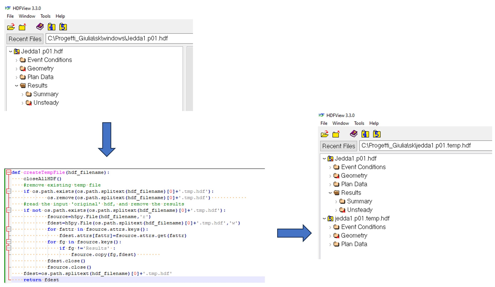
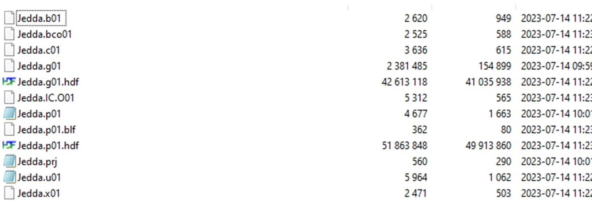
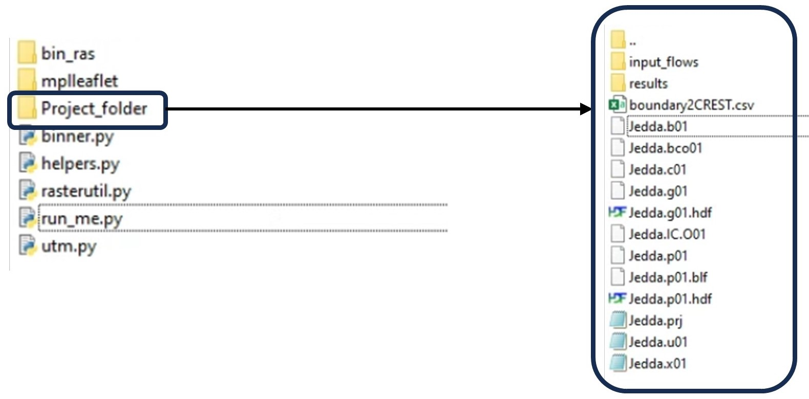

## Hydraulic modeling in linux
Keywords: `Hydraulics` `HEC-RAS` `2D` `Modeling` `Unsteady` `Hydraulic`  `Linux`

 <b>Giulia Sofia, PhD</b> 
 giulia.sofia@uconn.edu 
 

### Scope
This section presents the recommended steps for running the two-dimensional (2D) simulation in Linux.

### Goals

* Prepare the project
* Prepare the input flows
* Run the python scripts

### HEC RAS Linux packet
The RAS_507_linux.zip contains the rasUnsteady64 Linux executable and supporting libraries

1. The HEC-RAS GUI will need to be run to provide a base set of the input files for the Linux compute.
   
Geometry based files

	- *.c01 
	- *.x01 
> Note: Text based files will need to have the ending carriage return character stripped to be Linux compatible (.x04 and b04). 

- *.g01.hdf 
- *.b01 
- *.p01.tmp.hdf
- *.p01.hdf

The file tmp.hdf is needed to run HEC-Ras in linux. The *.tmp.hdf* is derived from an HEC-RAS GUI version of the original *.p01.hdf* that includes bcs, plan and geometry data, but has been stripped of the results.  The file must have consistent name, and extension

Below is an extract of the script that creates the new tmp.hdf from an input hdf

### Needed project files

1. After running the HEC-RAS GUI, we can upload to the HPC, the following files

2. In addition to these files, the PHASE 3 system needs 
	- a *.Json file of all the outlets, and a json file of all the domains
 	- config.ini file, with the configuration of all the domains
	- a folder named 'input_flows' where all the CSVs for the CREST outlets are stored [will be created if it does not exist]
	- a folder named 'results' where the output maps will be saved  [will be created if it does not exist]
	
	
> Note: the jsons files can be created using any GIS software

### Folder organization in Linux

Below is how your folder should be organize, before running the system.

An existing project for linux can be found in \Projects\Linux\Project_linux.zip
Note that due to the settings of the file run_me, the folders should be organized and named as showed in the image above. If not, you will need to modify the script by hand,  to set the correct folders.

> Note : the bin ras folder must be 'cleared' by running at least once, in the ssh prompt, the following command
*chmod 755 bin_ras/rasUnsteady64*

### Run in linux

1. The provided [[script](https://github.com/Remotsensei/SK_training/run_me.py)] includes the whole pipeline to run the project previously created in linux. 
To run this script, we need to activate the conda environment by 

*conda activate*

*python run_me.py*

2. If everything works as planned, you should see your results in the folder 'results'.
