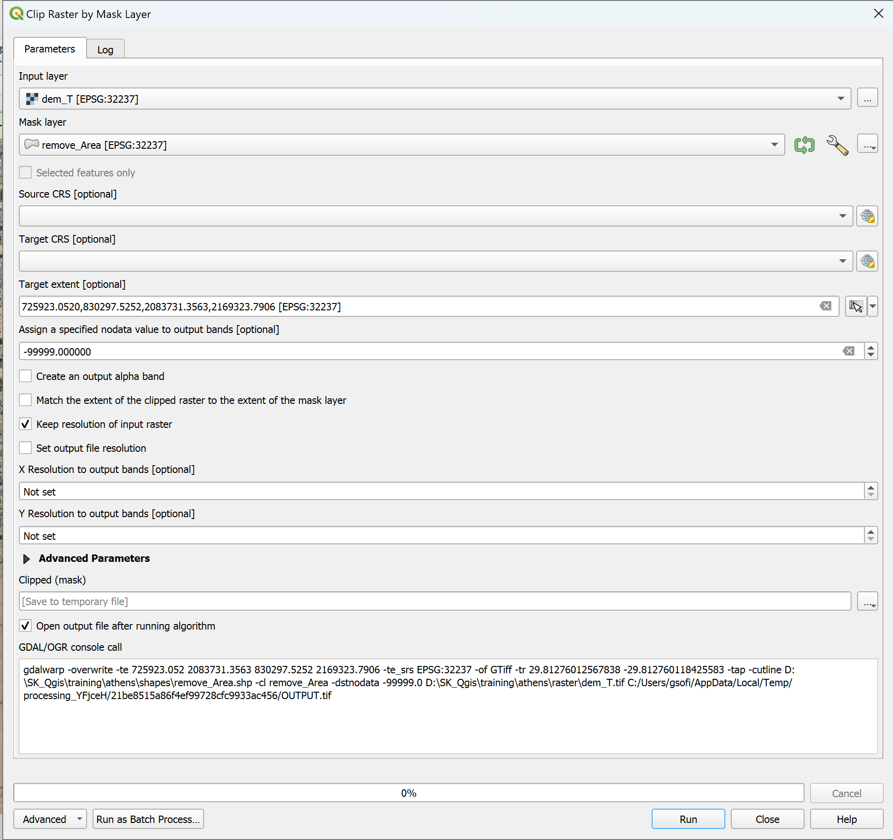
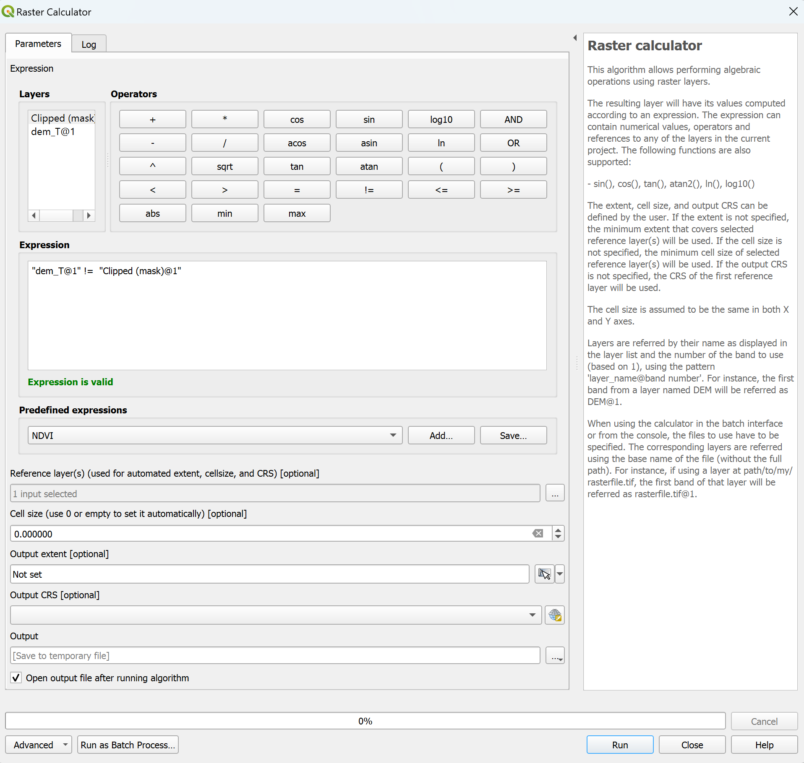
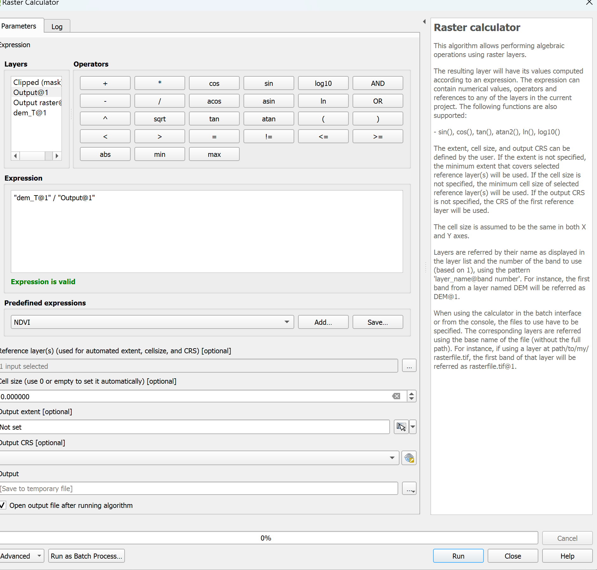
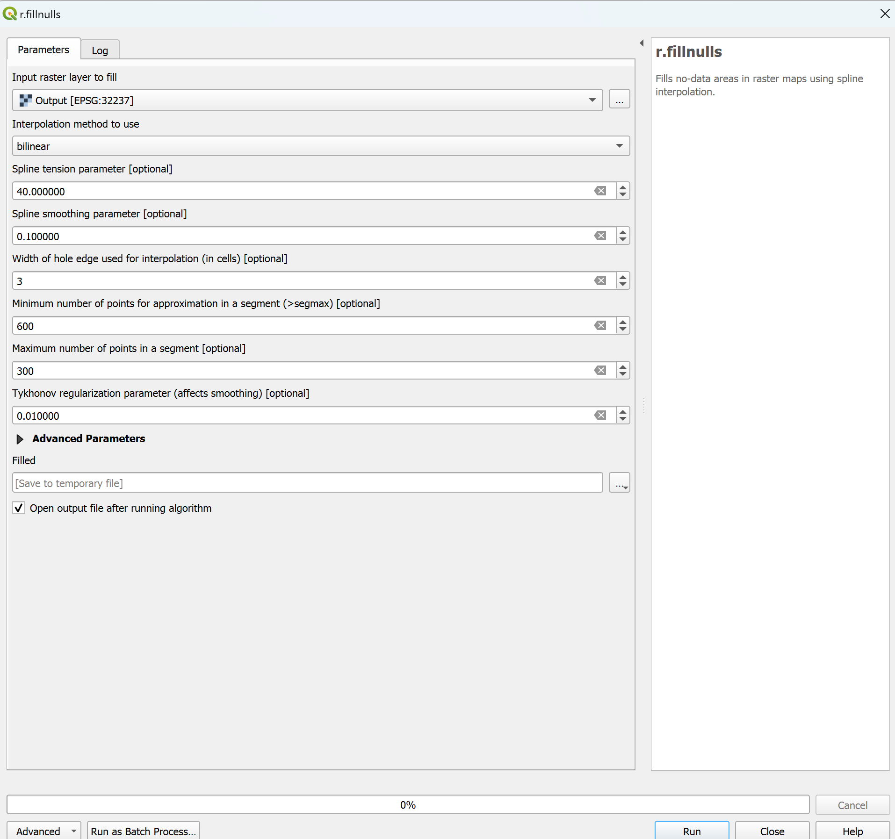

## Remove Roads and Bridges
Keywords: `Hydraulics` `terrain`

 <b>Giulia Sofia, PhD</b> 
 giulia.sofia@uconn.edu 
 

### Scope
This section presents the recommended steps for removing roads and bridges from a terrain data.

### Goals

* Visualize the terrain
* remove the bridges/roads

<ins> 1.	Load the Terrain and visualize the roads </ins>

Step 1: Add Your Elevation Raster
Next, go to Layer > Add Layer > Add Raster Layer to add your elevation raster. For this example, we will use the Terrain provided

Step 3: Access the Hillshade Tool
videos/hillshade1.mp4

<ins> 2.	Define your area of interest </ins>

In Qgis, we can ‘draw’ the area for which we want to remove the roads. At this stage, we can draw a simple area, around a single road. Optionally, one could create one for each road/bridge they want to remove

a.	Add the road file
b.	zoom to the road

c.  Create an empty layer  and save it in your working folder

c.	Set the parameters for the file
It is important to set a path where to save, select the type as polygon, and set the coordinates as EPSG:32237  [it must be the same coordinate system of your terrain!)
Once the layer is added automatically, right click on it, and set it as editable

d.	Draw a bounding box able to contain the whole extent of the road

On the toolbar, activate the ‘polygon’ tool. To show the toolbar, right-click the main menu and select Shape Digitizing toolbar
Draw your polygon to encompass the visible road on the terrain

Save the editing by making the layer ‘uneditable’, and confirm the changes

------------------------------------

Let's create a temporary layer, having only the road. We will need this as a 'negative mask', to filter out the road from the terrain
Check the below image to set correctly all parameters

As input file, we will use the original terrain data (With the road). AS Mask layer, we will use the polygon previously created. 
As Target extent, please consider to use the overall extent of the terrain, by selecting it from the drop down menu to the right.
**REMOVE the checkmark from 'Match the extent of the clipped raster...'
**CHECK 'Keep resolution of the input'

We will now create a mask, where the entire area under the polygon will be 1, and 0 otherwise

With the raster calculator, we will now set the road area as nodata

Finally, we will fill the dataset

